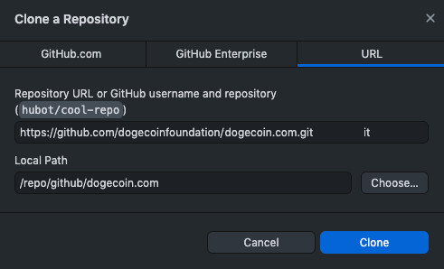

# How To Get Dogecoin Preview Website

- [How To Get Dogecoin Preview Website](#how-to-get-dogecoin-website)
  - [Install Git](#install-git)
    - [Install Git (Command-line)](#install-git-command-line)
    - [Install Git (GUI)](#install-git-gui)
  - [Get the code](#get-the-code)
    - [Using Git Command-line](#using-git-command-line)
    - [Using Github Desktop (GUI)](#using-github-desktop-gui)

## Install Git

You could use command-line version of git or GUI version of git, either way is fine.

### Install Git (Command-line)

* Windows/Mac/Linux: https://git-scm.com/downloads

### Install Git (GUI)

* Windows/Mac: https://desktop.github.com/

## Get the code

### Using Git Command-line

* Open the terminal on Windows/Mac/Linux
```
$ git clone https://github.com/dogecoinfoundation/dogecoin.com.git .
```
### Using Github Desktop (GUI)

* Open Github Desktop
* Add -> Clone Repository
* URL: https://github.com/dogecoinfoundation/dogecoin.com.git
* Clone it to your local machine
